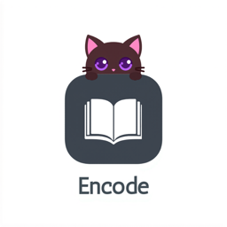

# Encode

<p align="center">
  
</p>

<p align="center">
  A desktop study environment that makes you think harder about what you're learning.<br/>
  Built with Tauri 2.0.
</p>

Encode isn't a note-taking app. It's a structured learning system backed by cognitive science research — spaced repetition, retrieval practice, elaborative interrogation, and the Feynman technique. All your knowledge lives as plain markdown files you own forever.

## How It Works

**Import content** (URLs, paste, or write from scratch) into a structured vault organized by subject and topic.

**Read section by section** with digestion gates that force you to stop and engage with the material before moving on. AI coaches you toward deeper understanding.

**Build flashcards** with FSRS spaced repetition (89.6% recall accuracy). Cards are auto-suggested from your reading, or create your own.

**Take quizzes** generated from your content at progressive Bloom taxonomy levels.

**Teach it back** using the Feynman technique — explain a topic simply, and AI evaluates your understanding.

**Everything saves as markdown.** Delete the database and it rebuilds from your files. Zero lock-in.

## Features

- **Obsidian-style editor** — CodeMirror 6 with live preview decorations, slash commands, and autosave
- **Digestion gates** — Rotating prompts (summarize, connect, predict, apply) at section boundaries
- **FSRS spaced repetition** — Free Spaced Repetition Scheduler with automatic card scheduling
- **AI-powered quizzes** — Multiple question types with evaluation and feedback
- **Teach-back mode** — Feynman technique with AI accuracy/simplicity scoring
- **Quick switcher** — `Cmd+O` fuzzy search across all vault files
- **Themes** — Multiple color themes built in
- **Auto-updater** — Notifies you when a new version is available
- **Tiered AI** — Ollama (local/free), Claude API, or Gemini API. No-AI mode works too.

## Tech Stack

| Layer | Technology |
|-------|-----------|
| Framework | Tauri 2.0 (Rust backend, system webview) |
| Frontend | React 18 + TypeScript (strict) |
| Styling | Tailwind CSS 4 |
| State | Zustand (domain-split stores) |
| Editor | CodeMirror 6 with custom decorations |
| Database | SQLite (rusqlite, bundled) — index only |
| Markdown | marked + DOMPurify |
| Spaced Rep | FSRS (Free Spaced Repetition Scheduler) |
| Icons | Lucide React |

## Download

**Current version: v0.8.1**

Grab the latest release for your platform from [Releases](https://github.com/samieh-abdeljabbar/encode-app/releases/latest).

- **macOS**: `.dmg` (Apple Silicon & Intel)
- **Windows**: `.exe` installer or `.msi`
- **Linux**: `.AppImage`, `.deb`, or `.rpm`

> First launch on macOS: Right-click the app, click Open, then Open again (bypasses Gatekeeper).
> First launch on Windows: Click "More info", then "Run anyway" (bypasses SmartScreen).

## Build from Source

**Prerequisites:** Node.js 20+, Rust 1.77+, and [Tauri 2.0 prerequisites](https://v2.tauri.app/start/prerequisites/) for your platform.

```bash
# Clone
git clone https://github.com/samieh-abdeljabbar/encode-app.git
cd encode-app

# Install dependencies
npm install

# Run in development
npm run tauri dev

# Build for production
npm run tauri build
```

## Vault Structure

All data lives in `~/Encode/` as plain markdown files:

```
~/Encode/
├── subjects/
│   └── {subject}/
│       ├── _subject.md        # Subject metadata
│       ├── chapters/          # Imported + digested content
│       ├── flashcards/        # Cards with FSRS scheduling
│       ├── quizzes/           # Quiz sessions with results
│       ├── teach-backs/       # Feynman explanations with evaluation
│       └── maps/              # Mermaid diagrams
├── daily/                     # Daily commitments
├── captures/                  # Quick thoughts
└── .encode/
    ├── encode.db              # SQLite index (rebuildable)
    └── config.toml            # Settings
```

## AI Configuration

Encode supports three AI providers, configured in Settings:

| Provider | Cost | Quality | Privacy |
|----------|------|---------|---------|
| **Ollama** (default) | Free | Good (depends on model) | Full — runs locally |
| **Claude API** | Paid | Best | Sent to Anthropic |
| **Gemini API** | Free tier available | Good | Sent to Google |
| **None** | Free | N/A | Full — no network calls |

All features work without AI. Gates still prompt you to think, flashcards still schedule, quizzes require AI.

## Philosophy

This app exists because most study tools optimize for the wrong things. Highlighting creates an illusion of competence. Passive re-reading doesn't build durable memory. Gamification (points, streaks, badges) shifts motivation from learning to score-chasing.

Encode is built on research from cognitive science:
- **Retrieval practice** over re-reading
- **Spaced repetition** over cramming
- **Elaborative interrogation** over highlighting
- **The generation effect** — producing answers beats recognizing them
- **Interleaving** — mixing topics strengthens discrimination

The digestion gate is the core mechanic: you cannot move forward until you've engaged with what you just read.
