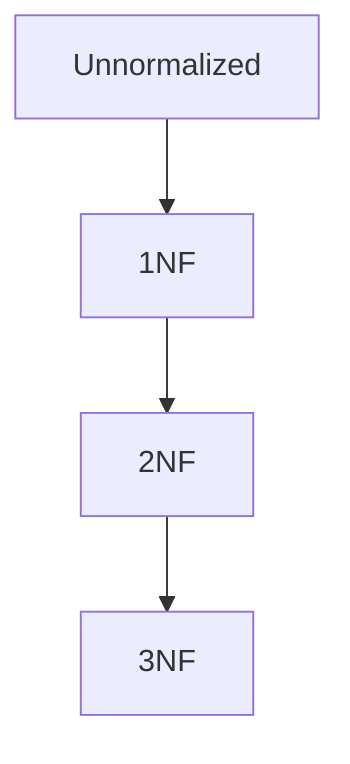

# Obsidian Deep-Dive: UX Research for Encode

**Purpose:** Inform the design and UX of Encode — a Tauri-based study app with a markdown vault — by studying what Obsidian does right, what it does wrong, and what patterns are worth adopting or improving.

**Research date:** March 2026
**Sources:** Obsidian official docs, community forums, comparative reviews, plugin ecosystem analysis, user sentiment surveys (2025-2026 data)

---

## Table of Contents

1. [What Obsidian Is](#1-what-obsidian-is)
2. [Core Features](#2-core-features)
3. [UI Structure & Layout](#3-ui-structure--layout)
4. [Navigation Patterns](#4-navigation-patterns)
5. [Editor Experience: Three Modes](#5-editor-experience-three-modes)
6. [Content Primitives: Callouts, Embeds, Mermaid](#6-content-primitives-callouts-embeds-mermaid)
7. [Organization Systems](#7-organization-systems)
8. [Plugin Ecosystem](#8-plugin-ecosystem)
9. [Themes & Customization](#9-themes--customization)
10. [Mobile Experience](#10-mobile-experience)
11. [What Users Love](#11-what-users-love)
12. [What Users Complain About](#12-what-users-complain-about)
13. [Obsidian vs. Competitors](#13-obsidian-vs-competitors)
14. [Encode: Actionable Takeaways](#14-encode-actionable-takeaways)

---

## 1. What Obsidian Is

Obsidian is a local-first, Markdown-based knowledge management app launched in 2020. Its tagline is effectively "your markdown files, supercharged." Every note is a `.md` file stored on your device in a "vault" — a regular folder you own. Obsidian reads those files and adds linking, graph visualization, search, and a plugin layer on top.

**Core philosophy:**
- Notes are plain `.md` files. Obsidian never locks your data in a proprietary format.
- No account required. The app works 100% offline by default.
- The community builds most of the interesting features via plugins (2,700+ as of 2026).
- Free for personal use, forever. Paid tiers: Sync ($5/mo), Publish ($8/mo), Catalyst (one-time supporter).

**Why this matters for Encode:** Encode shares this exact philosophy. Markdown files are the source of truth. The research below validates that philosophy as correct and beloved.

---

## 2. Core Features

### 2.1 Wiki-Links (`[[note name]]`)

The fundamental linking primitive. Type `[[` and Obsidian autocompletes from vault filenames. Links work with or without file extension. You can alias links: `[[actual-filename|Display Name]]`. Links to non-existent files are valid and shown as "unresolved links" — creating them later heals the link automatically.

**Variants:**
- `[[note]]` — link to a note
- `[[note#Heading]]` — link to a specific heading
- `[[note#^block-id]]` — link to a specific block
- `![[note]]` — embed/transclude the full note
- `![[note#Heading]]` — embed just that section
- `![[image.png]]` — embed an image

**Encode implication:** Already in CLAUDE.md. The `[[filename]]` pattern is Obsidian-compatible. Ensure the resolver handles heading-level links (`#Heading`) and block-level references (`#^block-id`) if Encode ever needs deep-linking into sections.

### 2.2 Backlinks Panel

Every note has an automatically computed backlinks panel showing all other notes that link to the current note. Two sub-sections:
- **Linked mentions** — explicit `[[this-note]]` references
- **Unlinked mentions** — text that matches the note title but hasn't been formally linked yet

Clicking a backlink navigates to the source note. The panel shows a snippet of surrounding context for each mention.

**Encode implication:** Backlinks are how users discover relationships they didn't consciously create. For a study app, this is enormously valuable — a student links "normalization" in a chapter note, and later sees that backlink from a quiz note, a teach-back, and a flashcard. The connection surface reveals the depth of their engagement.

### 2.3 Graph View

A force-directed, interactive visualization of all notes as nodes and all links as edges. Features:
- **Filters** — include/exclude folders, tags, or orphan nodes
- **Groups** — color-code nodes by tag or folder pattern
- **Depth** — zoom in on clusters
- **Local graph** — per-note graph showing only the immediate neighborhood (1-3 hops)

The global graph is visually stunning but practically useful mainly for spotting orphan notes (unconnected islands) and dense knowledge clusters. The **local graph** is more actionable — it shows a note's direct context.

Community assessment (2025 report card): Canvas received 3 stars. Graph view is beloved aesthetically but users report it offers limited utility for large vaults. It's great for marketing screenshots, less great for actual navigation.

**Encode implication:** A mini local graph on the subject dashboard could show how chapters, flashcards, quizzes, and teach-backs connect. Don't build the global graph first — it's expensive and low-utility at small vault sizes. The local graph (per subject or per chapter) is the right scope.

### 2.4 Canvas

Obsidian Canvas (introduced v1.1.0) is an infinite spatial board. Notes, images, links, and free-text cards can be positioned anywhere and connected with arrows. Canvas files are stored as `.canvas` (JSON) in the vault.

Key capabilities:
- Drag existing notes onto the canvas; they render inline and are fully editable
- Draw arrows between any two cards
- Group cards in labeled color-coded boxes
- Pan and zoom the infinite board
- Embed images, web links, and code blocks

Current state: "half-baked" per community — useful for brainstorming sessions, not deeply integrated with the graph or backlink system. Canvas files don't appear in the main graph view by default (requires plugin).

**Encode implication:** Encode uses Mermaid diagrams in markdown — that's the right call. Canvas is heavy infrastructure for a study-focused app. Mermaid covers concept maps, ERDs, flowcharts, and sequence diagrams directly in the note. Skip Canvas-style UI; keep Mermaid as the visualization primitive.

### 2.5 Properties / Frontmatter

Obsidian 1.4 introduced a visual Properties UI on top of YAML frontmatter. Instead of typing raw YAML, users see a structured form:

```
Title     [Study Guide]
Date      [2026-03-21]
Tags      [#sql] [#normalization]
Status    [in-progress]
```

Underlying storage is still YAML. Property types: text, number, checkbox, date, datetime, list, links. As of v1.9, Obsidian deprecated singular `tag`/`alias`/`cssclass` in favor of plural list forms (`tags`, `aliases`, `cssclasses`).

Properties power Dataview queries, Bases views, and search filtering. They're the structured metadata layer over the flexible markdown body.

**Encode implication:** Encode's YAML frontmatter approach is architecturally correct. Consider whether the UI should expose frontmatter directly (raw YAML) or behind a form UI (Obsidian-style Properties panel). For a study app, a hybrid is best: show curated fields (subject, topic, type, created_at) as a clean panel, but let power users see/edit raw YAML via an "Advanced" toggle.

### 2.6 Templates

Core plugin. Designated folder holds template files. Inserting a template pastes its contents into the current note. Supports `{{date}}`, `{{title}}`, `{{time}}` variables. Limited compared to Templater plugin.

### 2.7 Daily Notes

Core plugin. A new note is created for today (or opened if it exists) with a single keystroke or ribbon click. Notes are stored in a configurable folder with a date-based filename (e.g., `2026-03-21.md`). Template can be applied automatically.

**Pattern:** Users treat Daily Notes as their "inbox" — capture everything there throughout the day, then process it into permanent notes later.

### 2.8 Bookmarks

Replaced the old "Starred" plugin in v1.2. Bookmarks can be:
- Individual notes
- Searches (saved queries)
- Headings within a note
- Graph views
- Folders

Bookmarks are organized in a sidebar panel with custom groups and ordering. Unlike "Starred" (flat list), Bookmarks supports nested groups.

### 2.9 Search

Full-text search across all vault files. Accessed via Cmd+Shift+F. Supports:

| Operator | Function |
|---|---|
| `file:filename` | Search in specific files |
| `path:folder/` | Search in specific folders |
| `tag:#tagname` | Filter by tag |
| `line:(term1 term2)` | Both terms on same line |
| `block:(terms)` | Both terms in same block |
| `section:(terms)` | Both terms in same section |
| `task:` | Find all tasks |
| `task-todo:` | Find incomplete tasks |
| `task-done:` | Find completed tasks |
| `OR` | Boolean OR |
| `-term` | Exclude term |
| `/regex/` | Regular expression |

Search results show contextual snippets. Results can be embedded into notes via a special code block.

**Third-party enhancement:** Omnisearch plugin provides relevance-ranked results using BM25 scoring, similar to modern search engines. It's widely preferred over the built-in search for large vaults.

**Encode implication:** Encode uses SQLite FTS5 for vault search — architecturally superior to Obsidian's approach for a purpose-built app. The key UX pattern to adopt: show snippet context in search results, support tag/type/subject filtering, and surface results immediately as you type (not on Enter).

### 2.10 Quick Switcher

`Cmd+O` opens a floating modal with fuzzy-search over all note filenames. Type any characters and the list filters. Enter opens the note; Cmd+Enter opens in a new tab.

**Encode implication:** Essential navigation primitive. Every note-centric app needs this. Map it to `Cmd+O` or `Cmd+K` (which users expect from Linear/Notion-era apps).

### 2.11 Command Palette

`Cmd+P` opens a searchable list of every available command — from both core and community plugins. Commands display their keyboard shortcuts inline. This is how users discover features without navigating menus.

**Encode implication:** As Encode gains features, a command palette becomes essential for discoverability. It removes the need for complex menu hierarchies and lets keyboard-first users stay in flow.

### 2.12 Bases (Core Plugin, v1.9, 2025)

The most significant 2025 addition. Bases turns any set of notes with shared properties into a queryable, editable database view — similar to Notion databases but backed by plain markdown files.

Features:
- Table view: rows = notes, columns = frontmatter properties
- Filter conditions: e.g., `status = "active"` AND `subject = "D426"`
- Sort by any property
- Edit property values inline (changes written back to the note's frontmatter)
- Formula columns: compute values (e.g., days since last review)
- Multiple views per base (different filters/sorts)

Bases files are stored as `.base` files in the vault. The plugin also shows in Canvas as an embedded view.

2026 roadmap: Bases API for plugins, grouping, more layout types, Publish support.

**Encode implication:** Bases is Obsidian catching up to what Encode's SQLite index already does. For Encode, the equivalent is the "flashcard dashboard" or "quiz history" — a structured view over notes. The key lesson: let users filter, sort, and edit directly in that view. Don't make them navigate to each file to change a due date or status.

---

## 3. UI Structure & Layout

### 3.1 Overall Architecture

```
[Ribbon] [Left Sidebar] [Main Content Area] [Right Sidebar] [Status Bar]
```

- **Ribbon** — narrow icon strip on the far left. Each core plugin and many community plugins add an icon here. Clicking opens their panel or triggers an action.
- **Left Sidebar** — houses: File Explorer, Search, Bookmarks, Tags view. Width is resizable, collapsible.
- **Main Content Area** — the editor/reader panes. Supports split panes (horizontal and vertical), floating windows, and a tab bar at the top.
- **Right Sidebar** — houses: Backlinks, Outgoing Links, Tags (for current note), Local Graph, Table of Contents (outline), Properties. Width is resizable, collapsible.
- **Status Bar** — bottom strip. Shows word count, cursor position, current Vim mode, and contextual plugin info (e.g., sync status, heading level).
- **Tab Bar** — across the top of each pane. Like browser tabs. Tabs can be pinned, reordered, split out into separate windows.

### 3.2 Left Sidebar Panels (typical)

1. **File Explorer** — tree view of vault folders and files. Right-click context menu for create/rename/delete/move. Drag-and-drop reorganization. Shows unresolved links as faint file icons.
2. **Search** — full-text search UI with results panel.
3. **Bookmarks** — grouped list of bookmarked notes, searches, and headings.
4. **Tags** — hierarchical list of all tags in the vault with note counts.

### 3.3 Right Sidebar Panels (typical)

1. **Backlinks** — linked mentions + unlinked mentions for the current note.
2. **Outgoing Links** — all `[[links]]` within the current note.
3. **Local Graph** — interactive mini-graph of the current note's neighborhood.
4. **Outline** — auto-generated table of contents from headings in the current note.
5. **Properties** — visual editor for the current note's frontmatter.

### 3.4 Split Pane System

- **Split vertically / horizontally** — any pane can be split to show two notes side-by-side.
- **Floating windows** — pop any tab out into its own OS window. Useful for dual-monitor setups.
- **Linked panes** — navigating in one pane follows in a linked pane (reader + editor pairing).
- **Tab groups** — multiple tab bars can exist in the same content area.

### 3.5 Focus Modes (via plugins)

Obsidian core has no dedicated "zen mode." Community plugins fill this:
- **Zen** — hides sidebars, ribbon, and status bar; inspired by iA Writer
- **ProZen** — goes further; removes even the scrollbar; adds a vignette effect
- **Typezen** — activates during active typing; restores UI when you stop

**Encode implication:** Encode's reader should be distraction-free by design. The sidebar should collapse automatically when entering a reading session. The "section by section" reading with gates is inherently focused — lean into that. The UI chrome should visually recede during reading and gate interaction.

---

## 4. Navigation Patterns

### 4.1 Quick Switcher (`Cmd+O`)

Fuzzy search over filenames. The single most important navigation tool. Users type a few characters and jump to any note. Fast, keyboard-first.

### 4.2 Command Palette (`Cmd+P`)

All commands from all plugins, searchable. Power-user essential. Shows keyboard shortcut for each command. Encourages exploration ("what can this app even do?").

### 4.3 History Navigation

- `Cmd+Alt+Left` — navigate back (browser back-button behavior)
- `Cmd+Alt+Right` — navigate forward
- Navigation history is per-tab

### 4.4 Tab Switching

- `Cmd+1` through `Cmd+9` — switch to tab by index (configurable)
- Tab bar supports reordering, pinning, closing

### 4.5 Breadcrumbs (via plugin)

Not a core feature. Community plugin "Breadcrumbs" lets users define parent/child relationships between notes via frontmatter and renders a navigation trail. Used for structured hierarchies (course → chapter → topic).

**Encode implication:** Encode needs clear breadcrumbs because of its deep hierarchy: Subject → Chapter → Section. Show a persistent breadcrumb trail in the reader header: `D426 Data Management > Normalization > 3NF`. Each segment is clickable.

### 4.6 Linking as Navigation

Wiki-links are not just for reference — they're a primary navigation method. Clicking `[[note]]` in reading mode navigates to that note. Cmd+Click opens in a new tab. Users "surf" their vault via links rather than the file explorer.

### 4.7 File Explorer Navigation

Traditional folder tree. Users with deeply organized vaults rely on it; users with flat vaults barely use it. The file explorer supports drag-and-drop, right-click menus, and collapsible folders.

---

## 5. Editor Experience: Three Modes

This is one of Obsidian's most discussed design choices. Three distinct modes exist:

### 5.1 Source Mode

Raw Markdown. WYSIWYG-off. You see `**bold**`, not **bold**. Stars, underscores, backticks, all literal. Pure text editing. Preferred by developers and users who want predictability.

### 5.2 Live Preview Mode

The default. WYSIWYG-ish hybrid: markdown syntax is rendered inline, but the cursor area reverts to source syntax for editing. Bold text looks bold unless your cursor is inside it, then you see `**bold**`. Images render, but when you click them, you see `![[image.png]]`.

This mode caused significant community friction when introduced because its rendering differs subtly from Reading mode. Complex elements (callouts, embeds, tables) often look slightly different between Live Preview and Reading mode.

### 5.3 Reading Mode (View Mode)

Fully rendered, read-only. Guaranteed to match the published output. No editing possible. Accessed via the toggle button in the top-right or `Cmd+E`.

**Community pattern:** Many users switch to Reading mode to "review" what they wrote, then back to Live Preview to edit. Some use Reading mode as their primary reading state and Source mode for writing.

**Encode implication:** Encode should not replicate this complexity. The study app has a clear intent: content is *read* in the reader (Reading mode equivalent) and *written* only in specific moments (gate responses, teach-backs, flashcard creation). Don't offer three modes. Offer:
1. **Read mode** — rendered, sectioned, with gate overlays
2. **Write mode** — for gate responses, teach-backs (simple text area, no markdown needed)
3. **Edit mode** — for users who want to edit the raw file (power user, accessed via file browser)

---

## 6. Content Primitives: Callouts, Embeds, Mermaid

### 6.1 Callouts

Callouts use a modified blockquote syntax and render as styled alert/admonition boxes. Built into Obsidian core (no plugin needed).

**Syntax:**
```markdown
> [!note] Optional Title
> Content here. Supports **markdown**, links, lists.
```

**Built-in callout types:**
| Type | Aliases | Color |
|---|---|---|
| `note` | | Blue |
| `abstract` | `summary`, `tldr` | Light blue |
| `info` | | Blue |
| `todo` | | Blue |
| `tip` | `hint`, `important` | Green |
| `success` | `check`, `done` | Green |
| `question` | `help`, `faq` | Yellow |
| `warning` | `caution`, `attention` | Yellow/orange |
| `failure` | `fail`, `missing` | Red |
| `danger` | `error` | Red |
| `bug` | | Red |
| `example` | | Purple |
| `quote` | `cite` | Gray |

Callouts can be foldable: `> [!note]-` starts collapsed, `> [!note]+` starts expanded.

Custom callout types can be created with CSS. The Admonitions plugin extends this significantly.

**Encode uses callout syntax for flashcards:**
```markdown
> [!card] id: fc-001
> **Q:** Question
> **A:** Answer
```

This is an excellent choice. It's Obsidian-compatible, renders visually in any Obsidian vault, and can be styled distinctively in Encode.

### 6.2 Embeds and Transclusion

`![[filename]]` embeds the entire content of another note inline — this is transclusion. The embedded content renders read-only in the host note. You cannot edit embedded content in place (a long-standing community request).

**Heading-level embed:** `![[note#Heading]]` embeds only the content under that heading.

**Block-level embed:** `![[note#^block-id]]` embeds a specific paragraph or list item. Block IDs are auto-generated or user-defined: append `^my-id` to any paragraph.

**Use cases:** Compose a "Map of Content" note that embeds sections from many other notes. Daily notes that transclude their template. Flashcard review decks that embed individual card files.

**Limitation:** Embedded content is read-only. This is a deliberate design choice — edit the source, not the embed. The community has requested editable embeds for years with no native resolution.

**Encode implication:** Encode could transclude chapter sections into review sessions — e.g., show the relevant section while the user answers a quiz question. Block-level references would enable "return to source" from a flashcard back to the paragraph that spawned it.

### 6.3 Mermaid Diagrams

Obsidian natively renders Mermaid in fenced code blocks:
````

````

Supported diagram types: flowchart, sequence, class, state, entity-relationship (ER), Gantt, pie, quadrant, requirement, gitGraph.

Renders in all three editor modes. In Reading mode, Mermaid renders as SVG. In Source mode, it's raw text.

**Encode implication:** Already planned. This is the right choice for concept maps, ERDs, process flows. Mermaid in a study app beats Canvas for structured learning content.

---

## 7. Organization Systems

### 7.1 The Great Debate: Folders vs. Links vs. Tags

This is Obsidian's most discussed philosophical question. Three camps:

**Folder-first (hierarchical):**
Structure via folder tree. Easy to understand, familiar from filesystem. Weakness: a note can only live in one folder; rigid hierarchy doesn't reflect interconnected ideas.

**Link-first (Zettelkasten):**
Minimal folders, everything linked via `[[wiki-links]]`. Structure emerges from connections. Strength: organic, mirrors how ideas actually relate. Weakness: harder to navigate without the graph or search.

**Tag-first:**
Tags as the primary organizational unit. A note can have many tags; they cross folder boundaries. Tags can be hierarchical with `/`: `#sql/normalization`. Weakness: tags proliferate and overlap with links.

**Hybrid (most common in practice):**
A few top-level folders (by note type or project), links for connections, tags for cross-cutting concerns. Example: folders for `Projects/`, `Areas/`, `Resources/`, `Archive/` (PARA method). Links for knowledge connections. Tags for status/type.

### 7.2 Popular Vault Structures

**PARA Method** (Projects, Areas, Resources, Archives) — by Tiago Forte. Most referenced system among Obsidian users.

**ACE** (Atlas, Calendar, Efforts) — newer, popular in Obsidian community.

**Johnny Decimal** — numerical hierarchy for large vaults.

**Flat vault** — many experts (including Obsidian's own Nick Milo) advocate for minimal folders and maximal linking. The graph view is your navigation.

**MOCs (Maps of Content)** — notes that serve as hub pages for a topic, listing and linking all related notes. An alternative to folder-based organization.

### 7.3 Tags

- Inline: `#tagname` anywhere in note body
- Frontmatter: `tags: [sql, normalization, wgu]`
- Hierarchical: `#sql/normalization` (creates nested tag in Tags panel)
- Tags panel in left sidebar shows all tags with note counts
- Tags are clickable — click to search all notes with that tag

### 7.4 Aliases

```yaml
aliases: [normalization, normal forms, database normalization]
```

Aliases allow linking to a note by alternative names: `[[normalization]]` resolves to a note titled "Normal Forms" if that alias exists.

**Encode implication:** Encode's vault structure is already opinionated (subjects → chapters/flashcards/quizzes/teach-backs) which is correct for a study app. The app doesn't need to be a general PKM. The structure reflects the study workflow. Tags within subjects can be used for topic-level cross-referencing.

---

## 8. Plugin Ecosystem

The plugin ecosystem is Obsidian's most powerful and most complex dimension. 2,700+ community plugins as of 2026. Here are the most relevant ones for Encode's design:

### 8.1 Dataview

**Downloads:** Millions. The single most-used community plugin.

**What it does:** Turns your vault into a queryable database. Reads frontmatter, tags, inline fields, and file metadata. Runs SQL-like queries that render as tables, lists, tasks, or calendars.

**Query example:**
```
```dataview
TABLE subject, created_at, status
FROM "subjects/D426"
WHERE type = "chapter"
SORT created_at DESC
```
```

**Inline queries:** `= this.subject` renders the current note's subject field inline.

**DataviewJS:** Full JavaScript access to the vault index for complex computed views.

**Limitation:** Queries render in Reading mode only (not Live Preview by default). Performance degrades on very large vaults. No two-way data binding — you view data, you don't edit it from the query result (that's what Bases is for).

**Encode implication:** Encode's SQLite approach is functionally equivalent to Dataview but faster and more reliable. The UX pattern to steal: embedded "database views" in notes — e.g., a subject overview note that shows all chapters, their last-digested date, and total flashcard count. In Encode, this would be rendered from SQLite, not from Dataview, but the UX should feel the same.

### 8.2 Templater

**What it does:** Advanced template engine for Obsidian. Supersedes the core Templates plugin.

**Key capabilities:**
- JavaScript execution: `<% tp.date.now("YYYY-MM-DD") %>`
- Dynamic title insertion, folder-based template auto-application
- User prompts: pop up a dialog asking for input during template execution
- File creation and manipulation from within templates
- Access to vault metadata and system info

**Example — auto-create frontmatter from a prompt:**
```
---
subject: <% await tp.system.prompt("Subject?") %>
created_at: <% tp.date.now("YYYY-MM-DD[T]HH:mm:ss") %>
type: chapter
---
```

**Encode implication:** Encode's content creation (import, new chapter, new flashcard) is handled by the Rust backend — this is the right architecture. Templater's UX lesson: when creating a new note, prompt for metadata upfront (subject, topic) before dropping the user into an empty file. Don't leave them with a blank screen.

### 8.3 Calendar & Periodic Notes

**Calendar:** Renders a monthly calendar in the left sidebar. Clicking a day opens/creates that day's Daily Note. Dot indicators show which days have notes. Widely used by journal-style Obsidian users.

**Periodic Notes:** Extends Daily Notes to weekly, monthly, quarterly, and yearly notes. Each period uses its own template and folder.

**Encode implication:** Encode has `daily/` in its vault structure for "One Thing" commitments. A calendar sidebar widget showing daily commitment history could be powerful motivation — seeing the chain of completed days.

### 8.4 Kanban

**What it does:** Turns a note into a Kanban board. Columns are Markdown headings; cards are list items. Moving a card updates the underlying Markdown. Supports due dates, tags, and filtering.

**Encode implication:** Not directly relevant to the study loop, but the pattern is important: interactive visual widgets that read from and write to Markdown files. The quiz history "dashboard" in Encode could use a similar approach — a visual view over structured data that's backed by plain files.

### 8.5 Excalidraw

**What it does:** Full Excalidraw whiteboard embedded in Obsidian. Draw diagrams, flowcharts, UI mockups, annotate images. Drawings saved as `.excalidraw` (JSON) files. Can embed note content directly in drawings. ExcaliBrain companion plugin builds a visual brain map from your vault's link structure.

**Encode implication:** Mermaid covers most diagram needs for study content. Excalidraw is overkill for Encode's scope. However, the "annotate an imported article with drawings" use case is worth noting for future consideration.

### 8.6 Spaced Repetition Plugin

**What it does:** Flashcard review system inside Obsidian. Uses SM-2 algorithm (same as Anki). Supports multiple card formats:

- Single-line: `Question :: Answer`
- Multi-line:
  ```
  Question
  ?
  Answer
  ```
- Cloze: `This is a ==cloze deletion==`
- Note-level review (review the entire note, not individual cards)

Cards can live anywhere in the vault and are tagged with `#flashcard` or custom tags to be included in review decks. Scheduling data is stored in the card content as HTML comments.

**Encode implication:** Encode's flashcard callout format (`> [!card] id: fc-001`) is better than this plugin's approaches because it's:
1. More readable in raw form
2. Metadata stored in visible frontmatter-style fields (Ease, Interval, Next, Last)
3. Grouped within their subject context

One thing to borrow from this plugin: **note-level review**. The ability to mark an entire chapter as "due for review" and surface it in a review queue — not just individual cards. This is particularly powerful for Feynman/teach-back sessions.

### 8.7 Tasks Plugin

**What it does:** Task management layer over Obsidian. Captures tasks from across the vault, filters/sorts by due date, priority, tags, completion status. Renders a unified task list in a query note.

**Task syntax:** `- [ ] Buy groceries 📅 2026-03-25 ⏫`

**Encode implication:** Encode doesn't need a task manager, but the pattern of aggregating items from across the vault into a unified view (in Encode's case: "all flashcards due today" or "all chapters not yet digested") is the same architectural pattern.

### 8.8 Style Settings

**What it does:** Provides a visual settings UI for themes and plugins that define style variables. Instead of editing CSS directly, users get sliders, color pickers, and dropdowns.

**Encode implication:** Encode's UI is controlled code. But for any configurable visual options (font size in reader, color scheme, line width), prefer a visual settings panel over exposing CSS variables directly.

### 8.9 Omnisearch

**What it does:** Replaces Obsidian's built-in search with a relevance-ranked full-text search. Uses BM25 scoring. Supports OCR (search inside images) and PDF content indexing.

**Encode implication:** Encode's FTS5 in SQLite is already BM25-ranked. The UX lesson from Omnisearch's popularity: the built-in search feels primitive. Users want Google-style "best match first" results, not just "does the term appear." FTS5 provides this — make sure Encode's UI surfaces ranked results, not just chronological matches.

---

## 9. Themes & Customization

### 9.1 Theme System

Obsidian uses CSS custom properties (variables) extensively. The full theme is swappable via a `.css` file in `.obsidian/themes/`. Community has hundreds of themes. Top ones by downloads:

- **Minimal** (by kepano, Obsidian's own head of design) — the gold standard. Extremely clean, highly configurable via companion plugin.
- **AnuPpuccin** — Catppuccin palette, very popular
- **Catppuccin** — official Catppuccin port
- **Things** — clean, inspired by macOS aesthetics
- **Prism** — colorful accents, good contrast

### 9.2 Minimal Theme — Design Lessons

Minimal is the most studied theme. Key design choices:

**Typography:**
- Editor/body: Inter or system-ui for UI, customizable per-user
- Reading content: can switch to serif (iA Writer Quattro or similar)
- Monospace: JetBrains Mono or Cascadia Code

**Color philosophy:**
- Extremely low-contrast backgrounds (near white or near black)
- One accent color only (configurable)
- Text colors in 3 tiers: primary, secondary (muted), tertiary (very muted)
- No gratuitous color use — color means something

**Layout:**
- File explorer: compact, minimal icons
- Reading width: constrained to ~680px for comfortable line length
- No visible borders — separation via spacing and subtle background tints only

**CSS customization:**
- Minimal exposes 50+ CSS custom properties for users to override
- CSS snippets go in `.obsidian/snippets/` folder — modular, composable
- Style Settings plugin provides a GUI for Minimal's configuration options

### 9.3 Typography in the Wild

Community consensus on reading typography in Obsidian:
- **UI elements:** System sans-serif (system-ui, -apple-system)
- **Reading content:** Serif preferred (iA Writer Quattro, Georgia, Merriweather, ET Book)
- **Headings in reading:** Large, clear hierarchy, generous spacing
- **Line height:** 1.6-1.8 for body text
- **Reading width:** 640-720px — wider causes eye fatigue

**Encode implication:** The CLAUDE.md typography choices (Georgia/Merriweather for reader content at 17px, line-height 1.8) are exactly aligned with Obsidian community best practices. These are proven for long-form reading.

---

## 10. Mobile Experience

### 10.1 iOS

Obsidian's iOS app is a full port with most desktop features. Limitations:

- **iCloud sync is unreliable.** Users consistently report unidirectional sync failures (Mac → iPhone works; iPhone → Mac fails). Files get "stuck uploading." No native conflict resolution.
- **Performance:** Large vaults (1,000+ notes) open slowly. Improved significantly in 2025/2026 updates.
- **Plugin support:** Most community plugins work on mobile now (2026 improvement), but desktop-specific ones don't.
- **Heavy editing is uncomfortable** — the mobile keyboard + small screen makes writing long notes hard.
- **Local graph, Canvas, and Bases** all work on mobile.

### 10.2 Android

More flexible than iOS for sync:
- Syncthing works natively — true peer-to-peer sync
- Dropsync / FolderSync for Dropbox/Google Drive
- Obsidian Sync (paid) for reliable cross-platform sync

### 10.3 What Works Best on Mobile

- Quick capture — opening a daily note and jotting a line
- Reading and reviewing notes
- Flashcard review sessions
- Browsing the graph view

### 10.4 Obsidian Sync (Paid Service, $5/mo)

Obsidian's own sync solution. End-to-end encrypted. Works on all platforms. Version history (up to 12 months). The only truly reliable sync method across all platforms. Community sentiment: "just pay for Sync if you use mobile."

**Encode implication:** Encode is a desktop-first app (Tauri). Sync is out of scope for v1. The lesson from Obsidian's mobile pain: sync is a hard problem; if you add mobile later, design the sync architecture first, not last.

---

## 11. What Users Love

From community analysis of reviews, forum posts, and Reddit threads (2024-2026):

### 11.1 Data Ownership (The #1 Love)

"Your notes from 2025 will still be readable in 2045." The plain-text, local-first architecture is the most cited reason users choose and stay with Obsidian. Users feel genuinely secure that their knowledge base won't disappear if a company pivots or gets acquired.

Direct quotes from community:
> "I'm not renting access to my thoughts. I'm building a permanent digital asset."

> "I've been burned by Evernote, Notion, and Roam. With Obsidian, if the app dies tomorrow, I still have 5,000 Markdown files that work in any text editor."

### 11.2 The Plugin Ecosystem (The #2 Love)

2,700+ plugins means "there's a plugin for that" almost always resolves to true. Users appreciate that the core app stays lean while plugins add exactly what each user needs. No bloat if you don't install it.

### 11.3 Keyboard-First Design

Power users deeply love that almost everything is accessible via keyboard. Command palette covers any gap. Vim mode is available. Users report "flow state" is rarely broken by having to reach for the mouse.

### 11.4 The Graph View (Aesthetic Love)

Even users who admit the graph isn't that practically useful love it. It creates a tangible sense of "my knowledge is growing and connecting." It's intrinsically motivating. Screenshots of people's graphs are a top post type in the community.

### 11.5 Flexibility / No Imposed Structure

Obsidian imposes nothing. No required folder structure, no mandatory fields, no prescribed workflow. Users build exactly the system they want. This freedom is deeply valued, especially by users who felt constrained by Notion's block system or Roam's outliner.

### 11.6 Community

The Obsidian Discord and forum are exceptionally active and helpful. YouTube creators (Nick Milo, Nicole van der Hoeven, Linking Your Thinking) produce extensive tutorial content. The community has created a rich ecosystem of vault templates, workflows, and plugin combinations.

### 11.7 Pricing Model

Free forever for personal use with no feature limitations. No ads, no data mining. Users report this builds trust and removes anxiety about long-term viability.

---

## 12. What Users Complain About

### 12.1 Steep Learning Curve (The #1 Complaint)

Obsidian drops new users into a blank screen with no guidance. The freedom that power users love is paralyzing for beginners. "Blank page paralysis" is a recognized phenomenon in the community.

Problems:
- No onboarding tutorial or sample vault (without explicitly choosing the help vault)
- Markdown syntax must be learned separately
- The plugin ecosystem is overwhelming — thousands of options, no curation
- Many popular workflows (Zettelkasten, PARA) must be learned from YouTube, not from the app itself
- The three editor modes (source, live preview, reading) confuse new users

### 12.2 No Real-Time Collaboration

Obsidian is fundamentally single-user. Obsidian Sync added real-time collaboration in 2026, but it's a paid add-on and arrived years after users asked for it. Teams use Notion instead.

### 12.3 Sync Complexity

Free sync requires technical knowledge (Syncthing, iCloud issues, Git). Paying $5/mo for Sync removes this pain but is still a barrier.

### 12.4 Mobile Lag

iOS sync and performance issues are consistently cited as Obsidian's weakest area. The mobile experience is "good enough for reading, not great for writing."

### 12.5 PDF Annotation Missing

Users want to annotate PDFs directly in Obsidian. Community plugins (Annotator) help but it's not native. For students, this is a significant gap.

### 12.6 Canvas Is Undercooked

Canvas received 3 stars in the 2025 report card. It's not integrated with the graph view, doesn't appear in backlinks, and feels like a separate tool bolted on rather than a native feature.

### 12.7 YAML Frontmatter Friction

Before the Properties UI (v1.4), YAML frontmatter was raw and error-prone. Even with the UI, users find metadata management tedious for large vaults. Bulk editing properties requires plugins.

### 12.8 The Plugin Dependency Trap

Popular plugins (Dataview, Templater) become load-bearing for many users' workflows. When a plugin is abandoned or breaks after an Obsidian update, workflows break. Users have lost data from plugin bugs. The community debates whether core features should absorb the most popular plugins.

### 12.9 No Built-In Study/Review Mode

Obsidian is a general-purpose PKM. There's no concept of "learning mode," spaced repetition native to core, or any pedagogical structure. Students must bolt on multiple plugins (Spaced Repetition + Dataview + Templater + Calendar) to approximate what a purpose-built study app would provide natively.

**This is Encode's entire opportunity.** Everything Obsidian forces students to cobble together from plugins, Encode provides natively.

---

## 13. Obsidian vs. Competitors

### 13.1 vs. Notion

| Dimension | Obsidian | Notion |
|---|---|---|
| Storage | Local files | Cloud (their servers) |
| Format | Plain Markdown | Proprietary block format |
| Offline | Full | Limited |
| Collaboration | Plugin/paid | Core feature |
| Structure | User-defined | Rich templates/databases |
| Price | Free core | Free tier, paid for teams |
| Plugin ecosystem | 2,700+ | Limited |
| Learning curve | Steep | Moderate |

**Why users switch FROM Notion TO Obsidian:** Data ownership concerns, offline needs, Notion's sluggishness on large workspaces, desire for plain text longevity.

**Why users keep Notion:** Team collaboration, richer visual design options, lower learning curve, better mobile.

### 13.2 vs. Logseq

Both are local-first, Markdown-based. Key difference:

| Dimension | Obsidian | Logseq |
|---|---|---|
| Structure | Page-based | Outliner (bullet-first) |
| File format | Standard Markdown | Markdown (with indented lists as primary UI) |
| Price | Free personal | Entirely free |
| Plugin ecosystem | Much larger | Growing |
| PDF annotation | Plugin only | Built-in |
| Mobile | Better | Weaker |

**Why users prefer Logseq:** Outliner structure suits daily logs and task-heavy workflows. PDF annotation is built-in (key for students). Entirely free (no paid sync tier).

**Why users prefer Obsidian:** Page-based structure for knowledge notes. Larger plugin ecosystem. Better mobile. More polished UI.

### 13.3 vs. Roam Research

Roam pioneered the backlink/daily-notes paradigm Obsidian built on. Key difference: Roam is cloud-only, proprietary format, $15/mo (or $500 lifetime). Users fled to Obsidian/Logseq for:
- Data ownership
- Price
- Performance (Roam becomes slow with large graphs)

### 13.4 vs. Bear / Craft / Notion

- **Bear:** Apple-only, beautifully designed, Markdown-compatible but proprietary. Dying for power users — slow feature updates.
- **Craft:** Apple-first, beautiful block editor, iCloud sync. No plugin ecosystem. More like a polished Notion than an Obsidian alternative.
- **Notion:** See above. The dominant team collaboration choice.

**The pattern:** Users who care about data ownership, longevity, and power end up at Obsidian. Users who want beautiful design and collaboration end up at Notion/Craft.

---

## 14. Encode: Actionable Takeaways

This section translates the Obsidian research into specific design and development decisions for Encode.

### 14.1 What Encode Inherits from Obsidian (Already Correct)

- **Plain `.md` files as source of truth** — validated by Obsidian's success. Never change this.
- **YAML frontmatter** — Obsidian-compatible. Use the plural form: `tags`, `aliases`.
- **Wiki-link syntax `[[file]]`** — exact same format. Full Obsidian compatibility.
- **Callout syntax for flashcards** — `> [!card] id: fc-001` is valid Obsidian callout syntax. Encode's flashcards will render in Obsidian (though without the SR scheduling behavior).
- **Mermaid diagrams in fenced blocks** — identical to Obsidian. Subject maps created in Encode are readable in Obsidian.
- **Typography choices** — serif reader font (Georgia/Merriweather), 17px, 1.8 line-height — matches Obsidian community best practices exactly.
- **SQLite for index only** — Obsidian uses its own in-memory index; Encode uses SQLite. Both treat the files as truth. The concept is sound.
- **Subject-based vault structure** — opinionated structure (subjects → chapters/flashcards/quizzes) is the right call for a study app. Obsidian's lesson: general-purpose freedom is paralyzing for beginners.

### 14.2 Navigation Patterns to Adopt

**Quick Switcher (`Cmd+O`):**
A floating fuzzy-search modal over all notes in the vault. Essential. Priority: high.

**Command Palette (`Cmd+P` or `Cmd+K`):**
Searchable list of all Encode actions. As the app grows, this becomes the discoverability safety net. Priority: medium (build as feature count grows).

**Back/Forward Navigation:**
`Cmd+[` and `Cmd+]` for browser-style history navigation within the reader. Priority: medium.

**Breadcrumb Trail:**
Show `Subject > Chapter > Current Section` in the reader header. Clickable. Always visible. Priority: high.

**Backlinks Panel:**
Right sidebar panel showing all other notes that link to the current chapter. For a study app, this surfaces "this concept also appears in quiz 3 and flashcard fc-042." Priority: medium.

### 14.3 Editor UX Patterns to Adopt

**Don't offer three modes.** Encode has clear intent: read to learn, write responses at gate moments. Design for two states:
1. **Reading state** — full-screen reader, section by section, gate overlays
2. **Writing state** — focused text area at gate/teach-back/quiz moments

**Prompt for metadata at creation time.** When a new chapter is imported or created, immediately ask: "Which subject does this belong to?" Don't make users edit raw frontmatter.

**Show properties as a panel, not raw YAML.** Display frontmatter fields (subject, topic, type, created_at) as a clean read-only panel in the sidebar. Advanced users can see raw YAML via a toggle or file editor.

### 14.4 Organization Patterns to Adopt

**Subject-scoped wiki-links.** Encode resolves `[[filename]]` within the same subject. This is the right scope. Cross-subject links should be possible but explicit.

**Tags for topics within subjects.** Use tags (stored in frontmatter) for topic-level cross-referencing: `#normalization`, `#sql`, `#BCNF`. Allow tag-based search within and across subjects.

**Bookmarks as pinned items.** The "bookmark" pattern — not just starring, but saving searches, headings, and specific sections — is useful. In Encode, a "bookmark" could be pinning a specific section to review later.

### 14.5 Content Features to Adopt

**Block references.** Allow `[[chapter-slug#^block-id]]` links so a flashcard or quiz question can reference the exact paragraph it came from. Clicking navigates back to that context in the reader.

**Outgoing links panel.** Show all wiki-links within the current chapter in a sidebar panel. Clicking navigates to the linked note. This surfaces the knowledge graph even without a visual graph view.

**Local knowledge graph (per-subject).** A mini graph view on the subject dashboard showing how chapters, flashcards, quizzes, and teach-backs interconnect. Built from SQLite link data. Not a global graph — just the subject neighborhood.

**Search result context snippets.** When displaying search results, always show a snippet of surrounding context (2-3 lines around the match). Obsidian's community added Omnisearch specifically because context snippets in results are critical.

### 14.6 Features That Solve Obsidian's Weaknesses

**Guided onboarding.** Obsidian's #1 complaint is the blank screen. Encode should not have a blank screen. The first-run experience should:
1. Ask for a subject name and description
2. Offer import options (URL, file, paste)
3. Walk the user through the first digestion gate
4. Introduce flashcard creation from the first digested chapter

**Study mode is native.** Everything Obsidian users need 4+ plugins to approximate (spaced repetition + review scheduling + quiz mode + teach-back capture), Encode does natively and cohesively.

**Structured metadata without YAML pain.** Obsidian requires users to know YAML. Encode's import and creation flows write frontmatter automatically. Users see a clean properties panel. No raw YAML unless they choose to edit the file externally.

**Section-by-section reading.** Obsidian shows the full note at once. Encode's gated, section-by-section reader is a UX innovation that has no Obsidian equivalent. This is the core differentiation — it's what forces active recall.

**Integrated AI context.** Obsidian has no native AI. Encode's AI router (Ollama/Claude/Gemini) is deeply integrated: gate feedback, coach, quiz generation. This is the gap Obsidian's community has been requesting for years and only partially addressing through external integrations.

### 14.7 Visual Design Decisions Informed by Minimal Theme

**Color usage:** Use color sparingly and meaningfully. Encode's defined palette (purple for encoding actions, teal for retrieval success, coral for emphasis, amber for warnings) follows Minimal's principle of "color means something."

**Background:** #0f0f0f (near-black) is consistent with dark-mode Minimal and popular Obsidian dark themes. This is the right choice.

**Surface hierarchy:** Three levels (#0f0f0f background, #1a1a1a surface, #252525 surface-2) matches Minimal's approach of subtle depth via background tints, not borders.

**Reader width:** 720px max-width for the reader matches the 640-720px sweet spot validated by Obsidian community experience and typography research.

**No decorative borders:** Separate sections with spacing and background color, not lines. Minimal proved users prefer this.

### 14.8 What NOT to Build (Confirmed by Obsidian Research)

- **Global graph view** — high development cost, low daily utility, more decorative than functional. Skip for v1. Per-subject local graph is enough.
- **Canvas/infinite whiteboard** — Mermaid covers study-specific diagram needs. Canvas would add complexity without proportional study value.
- **Plugin system** — Encode is purpose-built. A plugin ecosystem is appropriate only if the app becomes a general PKM. Stay focused on the study loop.
- **Real-time collaboration** — desktop-first, single-user is the correct v1 scope. Obsidian took years to add this; it's not a day-one feature.
- **Three editor modes** — the source/live-preview/reading complexity is one of Obsidian's most-criticized UX decisions. Don't replicate it.

### 14.9 The Strategic Positioning Insight

Obsidian is a **general-purpose PKM that students adapt for studying** — at the cost of significant setup friction, plugin complexity, and absence of a native study workflow.

Encode is a **purpose-built study environment that stores knowledge as Markdown** — Obsidian-compatible by design, but with the study workflow baked in.

The vault format compatibility means a user can open their Encode vault in Obsidian and have it "just work" — chapters render, flashcard callouts are visible, Mermaid diagrams display. This compatibility is a feature: it eliminates data lock-in concerns and lets Obsidian power-users feel at home while getting a study-specific UX they couldn't build themselves.

---

## Sources Consulted

- Obsidian official help docs (help.obsidian.md)
- obsidian.md changelog and roadmap
- practicalpkm.com — 2025 and 2026 Obsidian report cards
- obsidianstats.com — plugin ecosystem data
- deepwiki.com/obsidianmd — architectural analysis
- eesel.ai/blog/obsidian-overview — complete 2025 overview
- lindy.ai/blog/obsidian-review — honest review
- medium.com/@theo-james — multiple Obsidian analysis articles
- blacksmithgu.github.io/obsidian-dataview — Dataview documentation
- github.com/SilentVoid13/Templater — Templater documentation
- github.com/st3v3nmw/obsidian-spaced-repetition — SR plugin analysis
- github.com/kepano/obsidian-minimal — Minimal theme source
- primeproductiv4.com/apps-tools/obsidian-review — local-first analysis
- geeky-gadgets.com/obsidian-note-taking-app-guide-2025/ — beginner guide 2025
- alternativeto.net — Bases plugin announcement coverage
- obsidian.rocks — multiple how-to articles (Dataview, Canvas, Excalidraw, folders)
- thesweetsetup.com — Obsidian vs Roam vs Logseq comparison
- forum.obsidian.md — community sentiment, feature requests, complaints
